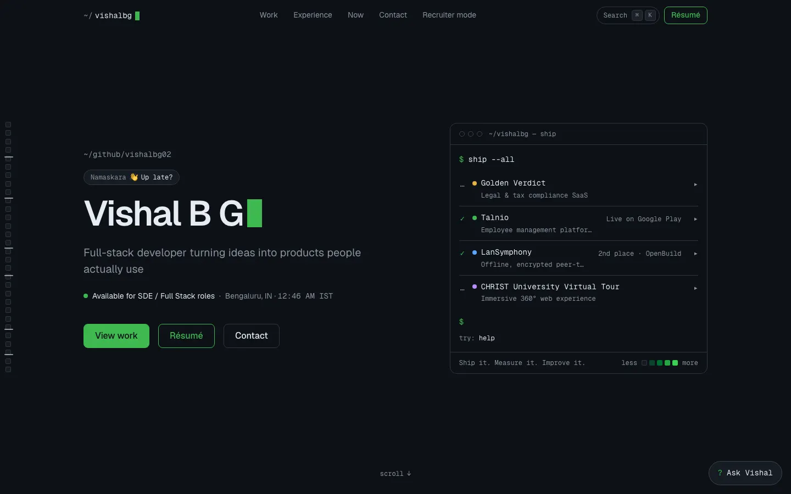
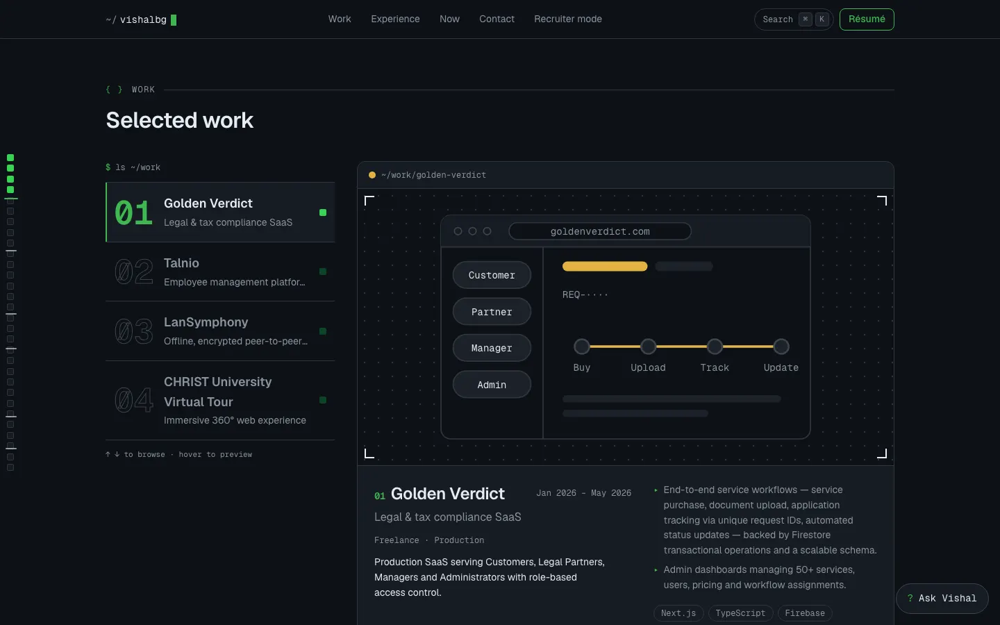
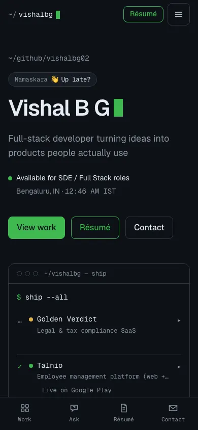
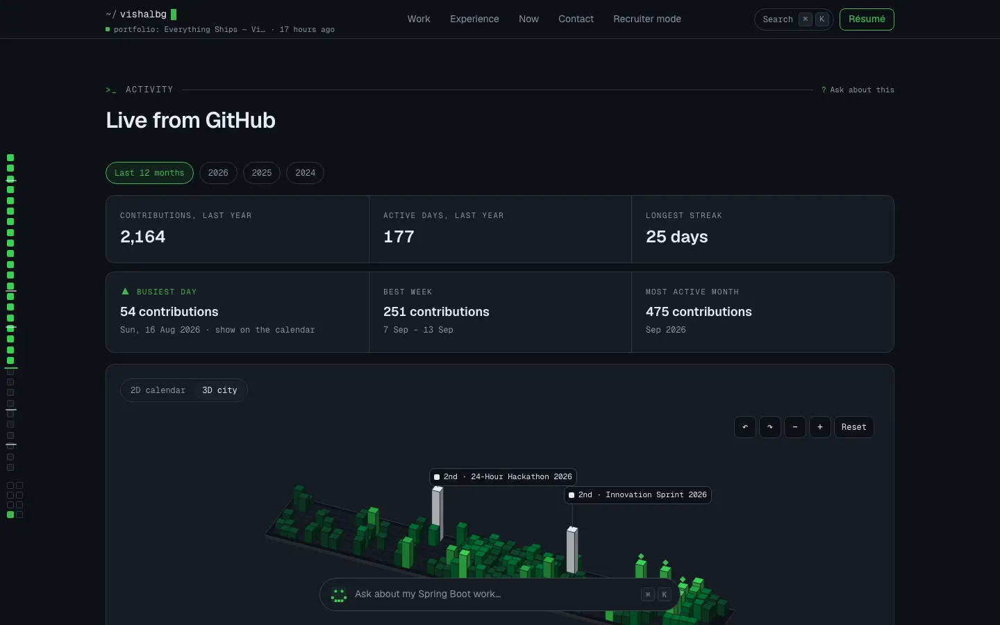
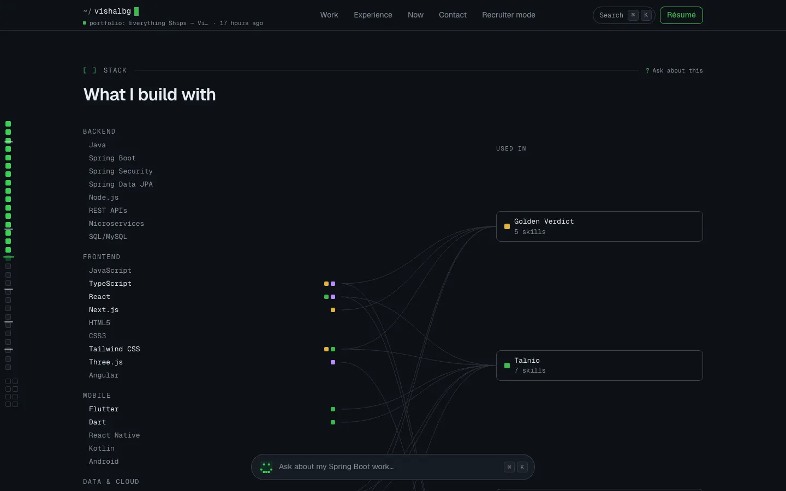
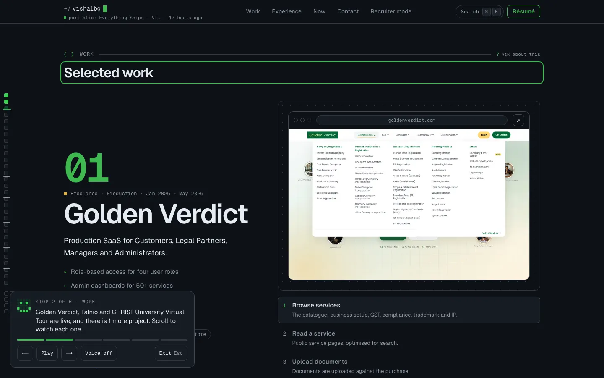

# V3 report: "The portfolio that talks back"

**Live:** https://vishalbg.vercel.app · **Repo:** https://github.com/vishalbg02/portfolio

V3 turned the V2 portfolio into one that answers: an AI (GRID) that has read every page and can show things, a live chat that lands in Telegram, a 60-second tour, personal links for each company, and a few signature visuals. It was built in eight phases, one branch and one squash-merged PR each, all gated by lint, typecheck, unit tests, the production build, the bundle budget, the static-pages guard, e2e with axe, visual regression and Lighthouse CI.

## Before and after

| V2 (last commit before V3)                       | V3                                              |
| ------------------------------------------------ | ----------------------------------------------- |
|  |  |
|  |  |
|     |     |

New in V3:

| GRID, the AI                        | 3D Commit City                      | Stack map                             | 60-second tour                      |
| ----------------------------------- | ----------------------------------- | ------------------------------------- | ----------------------------------- |
|  |  |  |  |

## What shipped

| Phase      | PR                                                     | What                                                                                                                                                         |
| ---------- | ------------------------------------------------------ | ------------------------------------------------------------------------------------------------------------------------------------------------------------ |
| 0          | [#20](https://github.com/vishalbg02/portfolio/pull/20) | Baseline fixes (clipped text at every width, quieter Experience), bundle diet, media pipeline, `/privacy`                                                    |
| 1          | [#21](https://github.com/vishalbg02/portfolio/pull/21) | Cinematic Work showcase with real product captures                                                                                                           |
| 2          | [#22](https://github.com/vishalbg02/portfolio/pull/22) | GRID: deterministic router, refusal gate, offline answers, model with tools, sources on every claim                                                          |
| 3          | [#23](https://github.com/vishalbg02/portfolio/pull/23) | GRID actions: draft a message, prepare one to Vishal (the visitor sends it), booking link, role-tailored one-page résumé, interview answers, three languages |
| 4          | [#24](https://github.com/vishalbg02/portfolio/pull/24) | Live chat: Telegram inbox, webhook, presence, signed thread links, daily digest                                                                              |
| GRID intro | [#25](https://github.com/vishalbg02/portfolio/pull/25) | A demo of GRID's real answers, a clearer pitch, a calmer chat                                                                                                |
| 5          | [#26](https://github.com/vishalbg02/portfolio/pull/26) | 3D Commit City, pixel dissolve, context cursor, Stack map, contact QR and vCard                                                                              |
| 6          | [#27](https://github.com/vishalbg02/portfolio/pull/27) | Keyboard navigation, 60-second tour, achievements, sound, night mode, visitor wall, personal company links                                                   |
| 7          | this PR                                                | Static-pages guard, real-capture Open Graph cards, accessibility and layout tests for the new states, CSP fix, docs                                          |

Details live next to the code: [README](../README.md), [GRID-AGENT](GRID-AGENT.md), [LIVE-CHAT-SETUP](LIVE-CHAT-SETUP.md), [SIGNATURE](SIGNATURE.md), [MEDIA](MEDIA.md), [SEO](SEO.md), [UPDATING-RESUME](UPDATING-RESUME.md).

## Numbers

|                                                                                    | V2               | V3                                               |
| ---------------------------------------------------------------------------------- | ---------------- | ------------------------------------------------ |
| Home initial JS (gzip, budget 170 KB)                                              | 162.2 KB         | **161.2 KB**                                     |
| Home CSS (gzip)                                                                    | 14.3 KB          | 18.1 KB                                          |
| Unit tests                                                                         | 515              | **911**                                          |
| End-to-end tests (Playwright)                                                      | 296              | **467**                                          |
| Production Lighthouse, mobile (performance / accessibility / best practices / SEO) | 0.97 / 1 / 1 / 1 | **0.95** / 1 / 1 / 1 (commit `4c20156`)          |
| Static pages                                                                       | all              | all (a CI step now fails if one becomes dynamic) |

Every V3 feature is a lazy chunk, so the home page carries about the same JavaScript as it did before V3.

**Be aware:** performance is at the 0.95 line, down from 0.97. Lighthouse's simulated LCP counts every byte requested before the first paint, and V3 added HTML (the new sections), CSS (+4 KB) and a few small always-mounted scripts. One Phase 6 preview run scored 0.94 and passed on a re-run. `.github/workflows/lighthouse-prod.yml` records the real number after each deploy (shown in the footer). If it drops below 0.95, the next saving is to load the always-mounted hosts (`ShortcutsHost`, `TourHost`, `CompanyLinkHost`, `RouteWipe`, `CursorHost`) in one chunk after the page is idle, about 9 KB gzip.

Quality gates that hold on every PR: no gradients, one accent colour, no horizontal overflow at 360 / 390 / 768 / 1280 / 1440 / 1920 px, zero serious or critical axe violations (WCAG 2.2 AA) on the new states, no console errors or CSP violations in any new flow, CLS under 0.05, reduced-motion variants for everything that moves.

## Environment variables

None are required: the site builds and runs with all of them unset, and each feature degrades on its own. Names only here; never commit values.

| Variable                                                                                                    | Enables                                                                   | Set in Vercel production |
| ----------------------------------------------------------------------------------------------------------- | ------------------------------------------------------------------------- | ------------------------ |
| `GEMINI_API_KEY`                                                                                            | GRID's first model route and the JD matcher                               | yes (also Preview)       |
| `GROQ_API_KEY`                                                                                              | GRID's backup routes                                                      | yes                      |
| `TELEGRAM_BOT_TOKEN`, `TELEGRAM_CHAT_ID`                                                                    | Messages to Vishal, live-chat inbox, `/link` alerts                       | yes                      |
| `TELEGRAM_WEBHOOK_SECRET`, `LIVE_CHAT_SIGNING_SECRET`                                                       | Telegram webhook check, signed thread links and company links             | yes                      |
| `UPSTASH_REDIS_REST_URL`, `UPSTASH_REDIS_REST_TOKEN`                                                        | Threads, presence, company links, shared rate limits and the daily AI cap | yes                      |
| `CRON_SECRET`                                                                                               | The daily digest (Vercel Hobby cron runs once a day)                      | yes                      |
| `GITHUB_TOKEN`                                                                                              | Live calendar, activity, year switcher                                    | yes                      |
| `RESEND_API_KEY`, `CONTACT_TO_EMAIL`                                                                        | Contact form delivery                                                     | yes                      |
| `CONTACT_FROM_EMAIL`                                                                                        | Sending to any inbox (needs a domain verified in Resend)                  | **no** (undecided)       |
| `NEXT_PUBLIC_TURNSTILE_SITE_KEY`, `TURNSTILE_SECRET_KEY`                                                    | Optional bot check on a first live message                                | no (optional)            |
| `NEXT_PUBLIC_SITE_URL`, `NEXT_PUBLIC_GSC_VERIFICATION`, `SHOW_RECOGNITION`, `AI_DAILY_LIMIT`, `SHOW_DRAFTS` | Canonical URL, Search Console tag, award pins, daily AI cap, drafts       | defaults are fine        |

## Still needs Vishal

These are marked `TODO(vishal)` in the code, and the UI hides what is unknown:

1. **Interview answers**: 12 questions in [`content/interview.ts`](../content/interview.ts), in your own words (2 to 5 sentences each). Until then GRID says it does not have an answer written down.
2. **Rotate the credentials you shared during the build.** The values in Vercel are the old ones. Put new values in `.env.local` (BotFather `/revoke` for a new bot token; new Groq and Upstash tokens), then sync them to Vercel (Production and Preview, as sensitive) and redeploy. If only the token changes, the Telegram webhook does not need re-registering.
3. **Verified sender domain for email.** The shared Resend sender only delivers to your own inbox. A domain costs money, so this waits for your decision.
4. **Case studies**: the "Why / Trade-off" lines and sample snippets in `content/work/*.mdx`, and the LanSymphony repository URL (`profile.projects[lansymphony].repo`), are written from the technologies, not from your notes. `/now` has an empty "reading" line.
5. **Questions from the brief (section 10)** that need a person: whether the Golden Verdict captures of the client's public site are fine to keep; whether "Three.js" is accurate for the Virtual Tour; the LanSymphony wording; Vercel Hobby versus Pro (the daily-only cron is the visible limit); whether to enable Gemini billing for a higher quota.
6. **Optional:** Turnstile keys, a launch milestone for Talnio on the calendar, and rewriting the three draft Ship Log posts in your voice (`draft: false` publishes them).

## Next steps worth doing

- Watch the production Lighthouse number for a few deploys; apply the idle-loaded hosts change above if it slips.
- A custom domain and a verified email sender (together, one decision).
- Real code excerpts in the case studies instead of illustrative snippets.
- Use the personal links: `/link <Company> <Role>` in Telegram, send the URL, and read the alerts. They show which companies actually open the site.
