# V4 report: "Make it unforgettable"

**Live:** https://vishalbg.vercel.app · **Repo:** https://github.com/vishalbg02/portfolio

V4 gives the site an entrance, makes GRID the centre of the home page and the proof of what Vishal can build, rolls
one design language out across every page, and fixes the defects found in V3. It was built in six phases, one branch
and one squash-merged PR each, with three design checkpoints Vishal approved. Every phase was gated by lint,
typecheck, unit tests, the production build, the bundle budget, the static-pages guard, e2e with axe, visual
regression and Lighthouse CI.

## Before and after

| V3 (the last commit before V4)                  | V4                                                  |
| ----------------------------------------------- | --------------------------------------------------- |
| 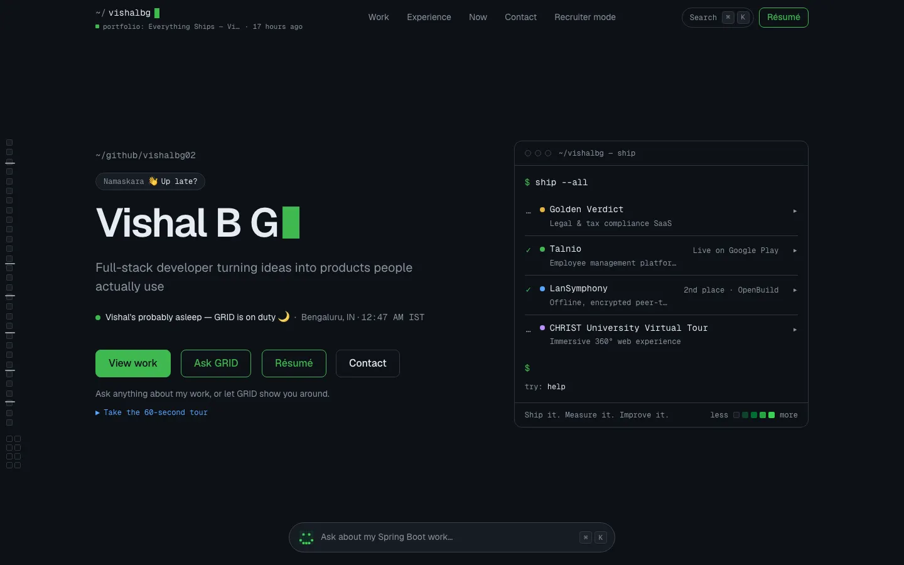 | 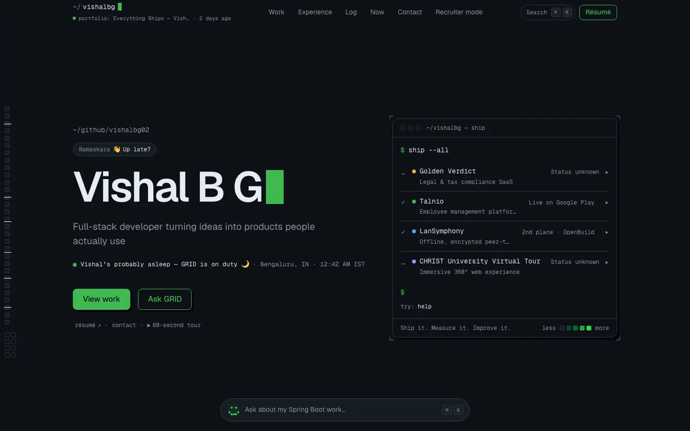           |
| 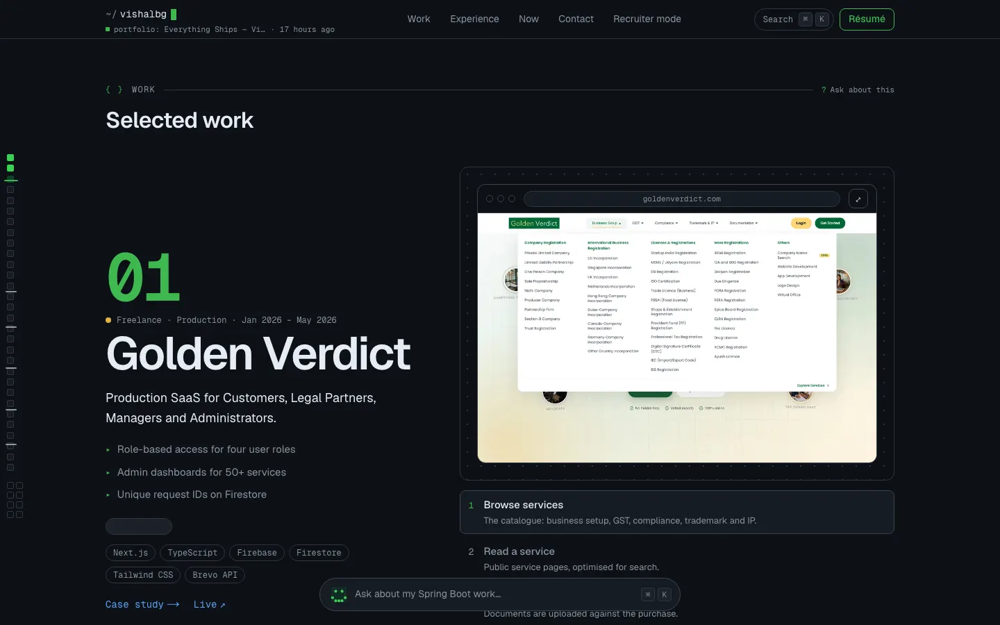 | 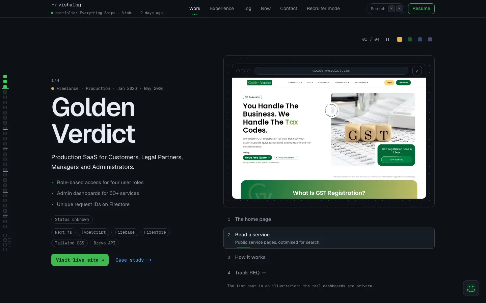           |
| 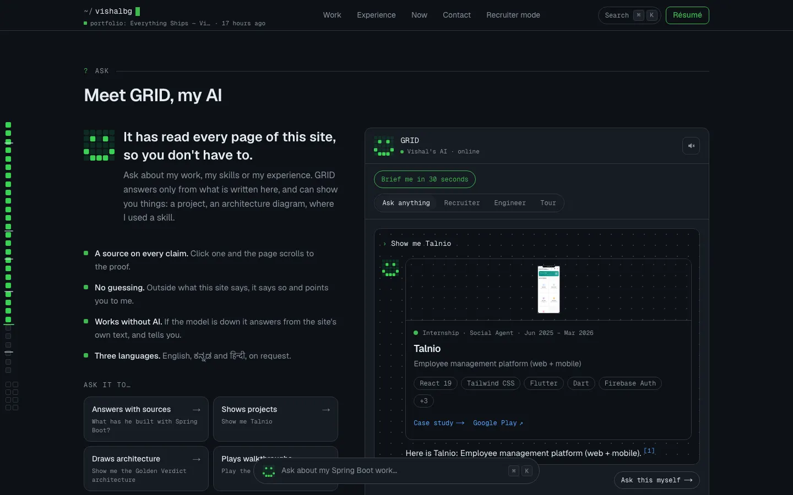 | 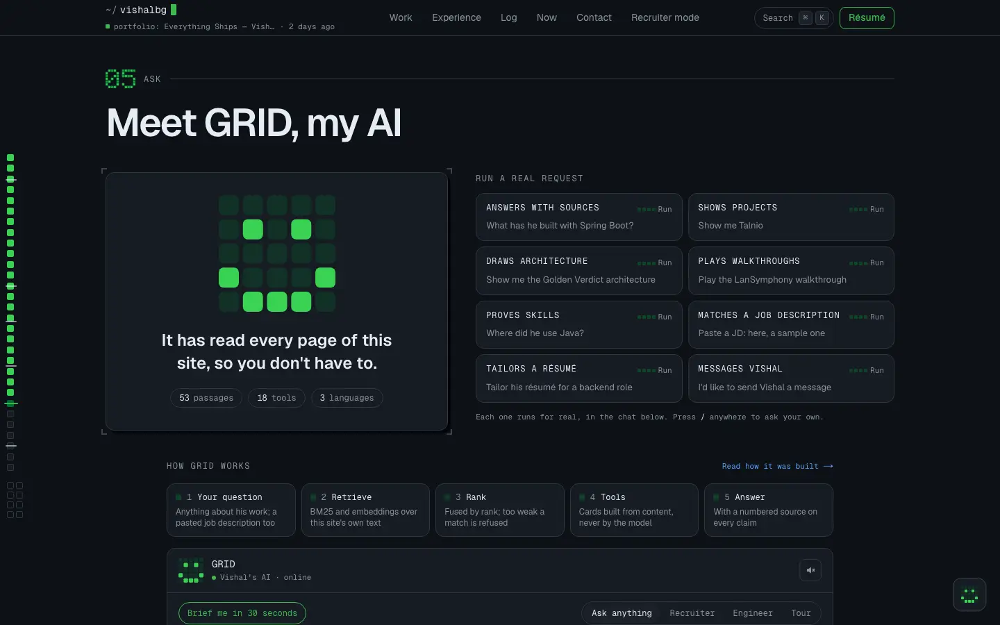 |
| 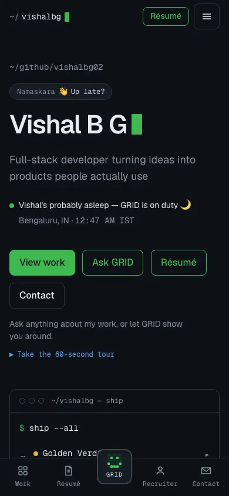    | 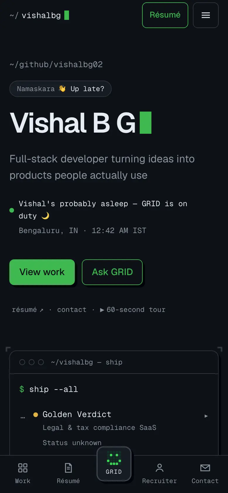              |

New in V4:

| The opening sequence                      | A tile's real run, with the pipeline lit          | The footer wordmark                 |
| ----------------------------------------- | ------------------------------------------------- | ----------------------------------- |
| 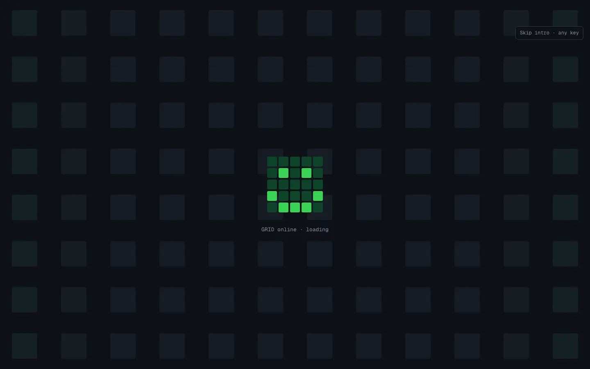           | 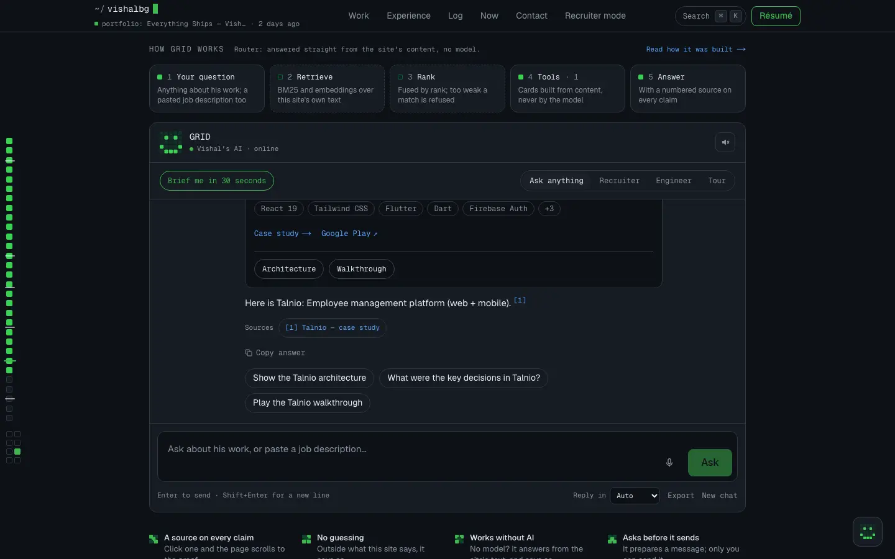             | 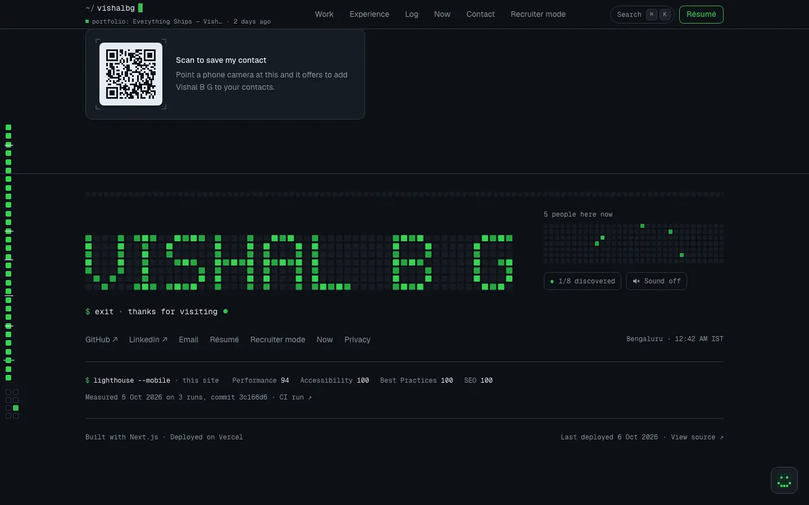   |
| 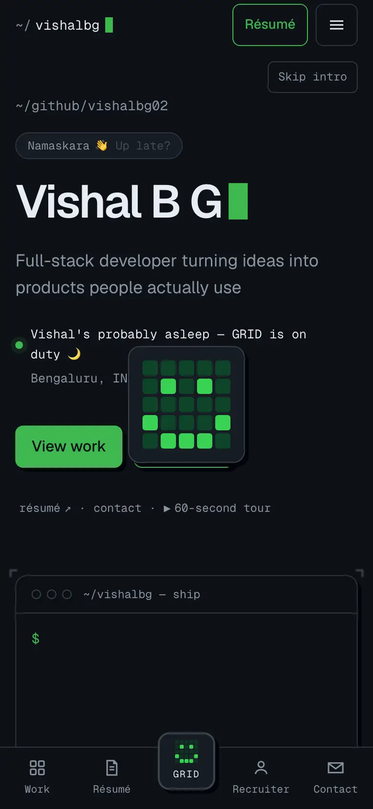 | 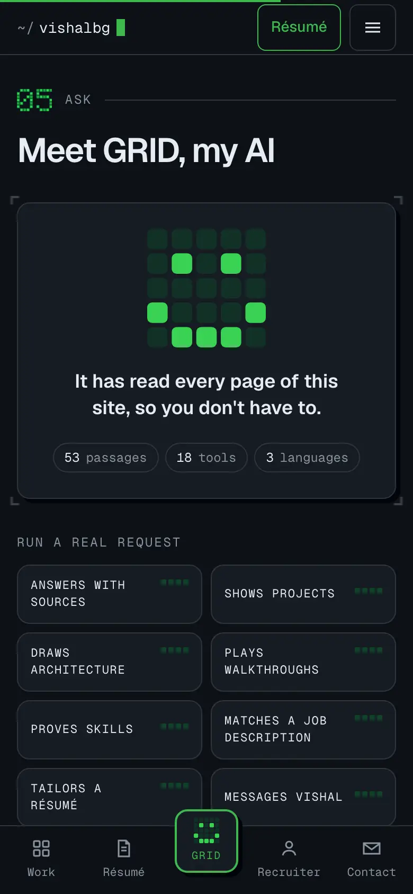 | 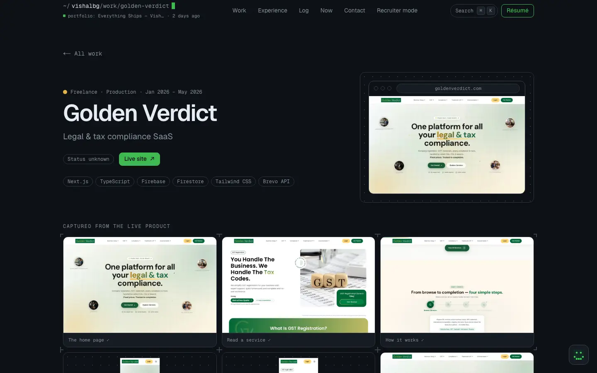 |

## What shipped

| Phase | PR                                                     | What                                                                                                                                                                                                                                                                          |
| ----- | ------------------------------------------------------ | ----------------------------------------------------------------------------------------------------------------------------------------------------------------------------------------------------------------------------------------------------------------------------- |
| 0     | [#29](https://github.com/vishalbg02/portfolio/pull/29) | The V3 fix list: Golden Verdict beats and the `embeddable` live status, roles on the Stack map, `pnpm interview`, an Omnibar that never covers a control, message slots pre-filled from what the visitor said, showcase intents, a shorter Work section, the pixel apostrophe |
| 1     | [#30](https://github.com/vishalbg02/portfolio/pull/30) | The opening sequence (CSS only, decided before paint by an inline head script, replayable), the new hero, V4 tokens, the inner pages' mini entrance · 🛑 Checkpoint 1                                                                                                         |
| 2     | [#31](https://github.com/vishalbg02/portfolio/pull/31) | Meet GRID: the stage, eight tiles that run real requests, the "How GRID works" strip lit by new `stage` stream events, the brief card · 🛑 Checkpoint 2                                                                                                                       |
| 3     | [#32](https://github.com/vishalbg02/portfolio/pull/32) | The design system on the home page: chapter openers, `PixelText`, a 52 px nav that marks the chapter you are reading, `DataState`, the sparse phone intro, home ≤ 11,000 px · 🛑 Checkpoint 3                                                                                 |
| 4     | [#33](https://github.com/vishalbg02/portfolio/pull/33) | Inner pages on the system, the phone app feel (pull-to-close sheets, a raised GRID button, 44 px tap targets everywhere)                                                                                                                                                      |
| 5     | this PR                                                | Performance hardening (home chunks merged), cross-device QA from 360 to 1920 px, this report, README                                                                                                                                                                          |

Details live next to the code: [README](../README.md), [DESIGN-V4](DESIGN-V4.md), [INTRO](INTRO.md),
[GRID-AGENT](GRID-AGENT.md), [MEDIA](MEDIA.md), [EMBEDDING-GOLDEN-VERDICT](EMBEDDING-GOLDEN-VERDICT.md).

## Numbers

|                                                      | V3 (bbd3346)                        | V4                                              |
| ---------------------------------------------------- | ----------------------------------- | ----------------------------------------------- |
| Home first-load JS (gzip, budget 170 KB)             | 161.3 KB                            | **161.7 KB**                                    |
| Home HTML (gzip)                                     | 61 KB                               | 68.1 KB (the intro, Meet GRID and the openers)  |
| Home height at 1440 × 900, every island loaded       | 14,403 px                           | **10,984 px** (guard: ≤ 11,000)                 |
| Work section at 1440 × 900                           | 6,566 px                            | 2,686 px                                        |
| Production Lighthouse, mobile (CI, 3 runs)           | 0.98 / 1 / 1 / 1                    | **0.97 / 1 / 1 / 1** (after Phase 3; see below) |
| Local Lighthouse, mobile, median of 5 (same machine) | 94 · LCP 3,062 ms · CLS 0           | **94 · LCP 3,061 ms** · CLS 0                   |
| LCP element                                          | the hero headline (server-rendered) | the same, never the intro                       |
| Unit tests                                           | 913                                 | 1,045                                           |
| E2E tests (Playwright + axe)                         | 468                                 | 551                                             |
| GRID evaluation set (`tests/ai-evals.md`)            | 40                                  | 56                                              |
| GRID tools / card kinds                              | 16 / 15                             | 18 / 17                                         |

**On Lighthouse.** Production mobile scores from the CI runner swing by about ±2 between runs of the same commit (V3
itself has scored 0.94 there). To compare fairly, every phase was also measured locally against a V3 build on the
same machine (mobile, five runs, medians). Two real regressions were found and fixed that way:

1. The full opening sequence covered the hero on phones and cost Speed Index on every cold run (the Lighthouse device is
   a phone). Phones now get a sparse sequence: the hero is visible from the first frame and only GRID's face wakes up
   and drops into the dock (the plan's own fallback). 93 → 94.
2. Growth in the home page's shared chunk (the dock, nav and Omnibar) pushed it over the bundler's split threshold, and
   the extra request moved simulated LCP by about 150 ms. `experimental.turbopackChunking.minChunkSize` now merges the
   home page's small chunks (fewer requests, and 2 KB less JS), and a shared module import that caused a split was
   removed. 93 → 94, LCP back to 3,061 ms.

The production numbers after the final merge are recorded by `lighthouse-prod.yml` in `generated/lighthouse.json` and
shown in the footer.

## Decisions made during the build

- **Phones get the sparse intro** (Phase 3): see above. Desktops keep the full sequence.
- **Work scrolls one screen for the first project and 55 % of a screen for each next one** (Phase 3), to bring home
  under 11,000 px without removing anything. Beats still auto-advance and can be paused.
- **The V3 demo reel was replaced by the Meet GRID tiles** (Phase 2, as planned): the tiles run the same kind of
  requests for real.
- **`Reveal` stays the one entrance primitive** instead of a new `useEntrance` (Phase 3): it already plays once, ships
  its final state in the markup and never arms under reduced motion.
- **`PixelText` draws one path per brightness level**, not an element per square (Phase 3): the footer wordmark is on
  every page, and per-square markup had added 6 KB of gzipped HTML.

## Still needs Vishal

Nothing here blocks the site; each one is hidden or labelled until it is filled in.

1. **Interview answers**: 12 questions, all empty. `pnpm interview` walks through them; at 3 answers the Interview mode
   appears in GRID and the answers join its corpus.
2. **Golden Verdict embedding**: the client's site sends `X-Frame-Options: DENY`. If the client agrees, apply the two
   edits in [EMBEDDING-GOLDEN-VERDICT](EMBEDDING-GOLDEN-VERDICT.md) on that site; the portfolio switches to the live
   embed by itself. Nothing was changed in that repository.
3. **LanSymphony** (done on 6 October): linked to its public code as ZeroConnect, the case study now quotes real code
   from it, shows the app itself, and says what its encryption is (Fernet: AES-128 + HMAC, for chat, files and voice,
   under a PBKDF2 key), checked in the code.
4. **Case studies**: the "Why / Trade-off" lines are written from the properties of each technology, and the code
   snippets are labelled illustrations. Replace either with your own notes and code when you want to.
5. **Milestones**: the month Talnio launched on Google Play, for a launch pin on the activity calendar.
6. **/now**: a book or paper you are reading (hidden while empty).
7. **Keys**: finish rotating the keys pasted during V3. No values appear in this report, the logs or any PR.
8. **Email**: a verified Resend sender domain is still a purchase decision.
